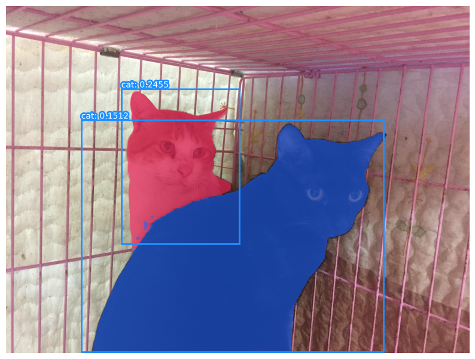

# Vision-Language Model Segmentation
Script for zero-shot Vision-Language Model segmentation ([Ren et al, 2024](https://doi.org/10.48550/arXiv.2401.14159)). It combines OWL-ViT open-vocabulary object detection ([Minderer et al, 2022](https://doi.org/10.48550/arXiv.2205.06230)) and Mobile SAM ([Zhang et al, 2023](https://doi.org/10.48550/arXiv.2306.14289)) promptable segmentation to segment objects in an image based on a text prompt. Images from the Cat Individual Images dataset ([Yeh, 2020](https://www.kaggle.com/datasets/timost1234/cat-individuals)) are used for demonstration.

Environment setup:

```bash
conda create -n myenv python=3.11
conda activate myenv
```

Dependencies installation:

```bash
pip install -r requirements.txt
```

Usage:

```bash
python vlm_segmentation.py
```

<p align="center">
    
</p>

### References

1. [Ren, T., Liu, S., Zeng, A., Lin, J., Li, K., Cao, H., ... & Zhang, L. (2024). Grounded sam: Assembling open-world models for diverse visual tasks. arXiv preprint arXiv:2401.14159.](https://doi.org/10.48550/arXiv.2401.14159)
1. [Minderer, M., Gritsenko, A., Stone, A., Neumann, M., Weissenborn, D., Dosovitskiy, A., ... & Houlsby, N. (2022, October). Simple open-vocabulary object detection. In European conference on computer vision (pp. 728-755). Cham: Springer Nature Switzerland.](https://doi.org/10.48550/arXiv.2205.06230)
1. [Zhang, C., Han, D., Qiao, Y., Kim, J. U., Bae, S. H., Lee, S., & Hong, C. S. (2023). Faster segment anything: Towards lightweight sam for mobile applications. arXiv preprint arXiv:2306.14289.](https://doi.org/10.48550/arXiv.2306.14289)
1. [Yeh, K.-T. (2020). Cat Individual Images (Version 1) [Data set]. Kaggle. kaggle.com/datasets/timost1234/cat-individuals](https://www.kaggle.com/datasets/timost1234/cat-individuals)
